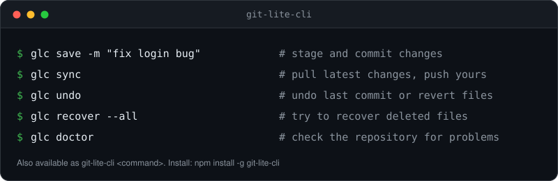
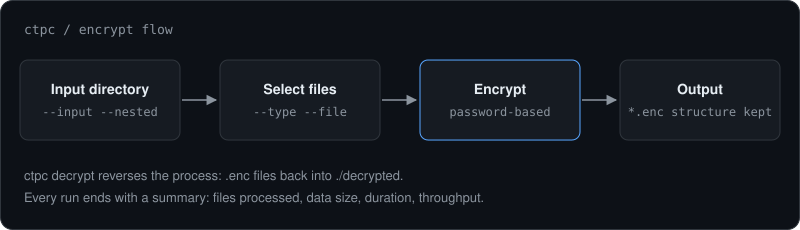
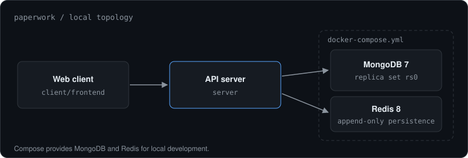
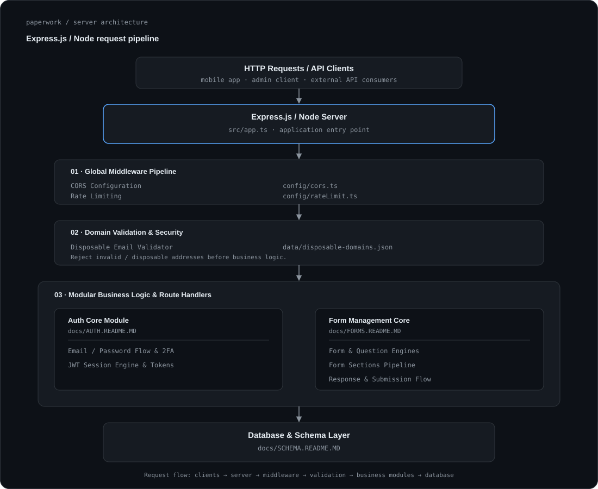

# Nikhil Katkuri

Software engineering student at the Hyderabad Institute of Technology and Management, building backend systems and developer tools in TypeScript and Node.js. I'm currently going deeper into database design, operating systems, computer networks, and distributed systems fundamentals.

[Portfolio](https://nikhilkatkuri.vercel.app) · [LinkedIn](https://linkedin.com/in/katkurinikhil) · [Email](mailto:knikhil07k@gmail.com) · [LeetCode](https://leetcode.com/u/z2NzIqiLZV/)

---

## About

Most of my work is in TypeScript and Node.js: backend services, command-line tools, and full-stack applications backed by MongoDB. I'm most interested in what sits below the UI: how data is stored and moved, how services fail, and how tools behave on real machines. I try to treat projects as software rather than demos, and to keep them usable by someone other than me.

## Projects

[**git-lite-cli**](https://github.com/NikhilKatkuri/git-lite-cli) is a TypeScript command-line tool that condenses multi-step Git and GitHub workflows into a small set of commands for saving, syncing, undoing, and recovering work. The part I spent the most time on was recovery and diagnostics for when repository state goes wrong, alongside GitHub token authentication. It is released on npm, currently at v3.0.0, with a changelog and contributing guide.

[**ctpc**](https://github.com/NikhilKatkuri/ctpc) encrypts files locally before they are uploaded to cloud storage. It works on whole directory trees in one run, filtering by extension or glob pattern, preserving folder structure, and reporting throughput when it finishes. It is published on npm as `@nikhil07k/ctpc`.

[**paperwork**](https://github.com/NikhilKatkuri/paperwork) is a schema-driven form and workflow platform I'm building as a client/server monorepo. The core idea is to describe forms and their workflows as data instead of hard-coding them into interface components. Local infrastructure runs on Docker Compose with MongoDB and Redis. It is still in development and not yet released.

## Experience

As an Android Developer Intern, I built modular features in Kotlin, integrated backend APIs, and handled asynchronous data for the UI. I investigated and fixed runtime crashes and memory issues, and worked inside Agile sprints using Git branching and code review. I have also taught Git workflows and full-stack development to students.

## Recognition

I placed as second runner-up (third place) at Microsoft Codeathon 2026, presenting an AI-powered solution in the final round at the Microsoft campus among invited engineering colleges. In the same month I was a Top 10 finalist at HackForge 2026, hosted at HITAM.

## Skills

- Core & Primary: TypeScript, Node.js, Express.js, MongoDB, RESTful APIs, WebSockets
- Languages: TypeScript, JavaScript, Python, SQL, Kotlin
- Databases & Caching: MongoDB, Redis
- DevOps, CI/CD & Cloud: Docker, GitHub Actions, Vercel, Git, pnpm
- Architecture & Concepts: Backend API Design, Real-time Communication, Schema Design, Data Persistence

## Education

B.Tech in Computer Science and Engineering at the Hyderabad Institute of Technology and Management. Coursework includes data structures and algorithms, database management systems, operating systems, computer networks, and software engineering.

## Contact

I'm open to engineering collaboration, open-source contributions, and internship or full-time opportunities. Email or LinkedIn is the fastest way to reach me.
